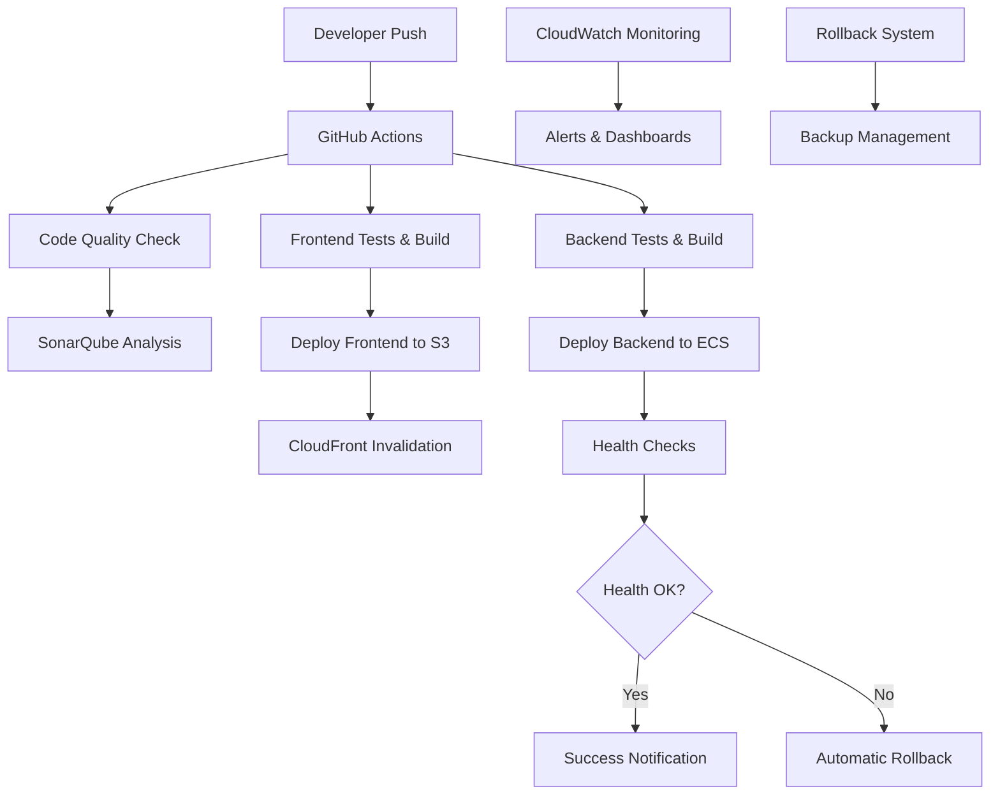
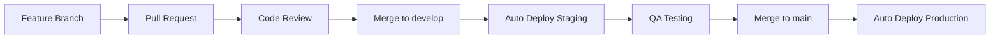

# 🚀 LABUREMOS CI/CD Complete System Guide

Sistema completo de CI/CD con deploy automático, monitoreo, rollback y zero-downtime para LABUREMOS.

## 📋 Tabla de Contenidos

1. [Resumen Ejecutivo](#resumen-ejecutivo)
2. [Arquitectura del Sistema](#arquitectura-del-sistema)
3. [Componentes Principales](#componentes-principales)
4. [Configuración Inicial](#configuración-inicial)
5. [Uso del Sistema](#uso-del-sistema)
6. [Monitoreo y Alertas](#monitoreo-y-alertas)
7. [Rollback y Recuperación](#rollback-y-recuperación)
8. [Troubleshooting](#troubleshooting)
9. [Mejores Prácticas](#mejores-prácticas)

## Resumen Ejecutivo

### ✅ Sistema Implementado

El sistema CI/CD para LABUREMOS incluye:

- **Deploy Automático**: Script unificado `deploy.sh` para staging y production
- **GitHub Actions**: Pipeline completo con tests, análisis de código y deploy
- **Monitoreo 24/7**: CloudWatch dashboards, alertas automáticas y métricas
- **Rollback Automático**: Sistema de recuperación automática ante fallos
- **Tests E2E**: Suite completa de tests con Playwright
- **Análisis de Código**: SonarQube integrado para calidad y seguridad
- **Zero-Downtime**: Deployments sin interrupciones de servicio

### 🎯 Beneficios Principales

- ⚡ **Rapidez**: Deploy completo en menos de 10 minutos
- 🛡️ **Confiabilidad**: Rollback automático ante fallos
- 📊 **Visibilidad**: Monitoreo completo de métricas y estado
- 🔒 **Seguridad**: Análisis automático de vulnerabilidades
- 🚀 **Zero-Downtime**: Sin interrupciones para usuarios

## Arquitectura del Sistema



### 🏗️ Componentes de Infraestructura

| Componente | Función | Estado |
|------------|---------|--------|
| **AWS S3** | Frontend estático | ✅ Configurado |
| **CloudFront** | CDN global | ✅ Activo |
| **ECS Fargate** | Backend containerizado | ✅ Desplegado |
| **RDS PostgreSQL** | Base de datos principal | ✅ Operativo |
| **ElastiCache Redis** | Cache y sesiones | ✅ Configurado |
| **CloudWatch** | Monitoreo y logs | ✅ Activo |
| **Route 53** | DNS management | ✅ Configurado |

## Componentes Principales

### 1. 📦 Script de Deploy (`deploy.sh`)

**Ubicación**: `/deploy.sh`

```bash
# Deploy a staging
./deploy.sh staging

# Deploy a production
./deploy.sh production

# Deploy con opciones
./deploy.sh production --force --skip-tests

# Rollback
./deploy.sh staging --rollback
```

**Características**:
- ✅ Validación de dependencias y credenciales
- ✅ Tests automáticos (unit, integration, E2E)
- ✅ Build optimizado para frontend y backend
- ✅ Deploy zero-downtime con health checks
- ✅ Rollback automático ante fallos
- ✅ Backup automático antes de deploy

### 2. 🔄 GitHub Actions Workflows

**Ubicación**: `/.github/workflows/`

#### Pipeline Principal (`ci-cd-main.yml`)

```yaml
Triggers:
- Push a main/develop
- Pull Request
- Manual dispatch

Jobs:
1. Code Quality & Security Analysis
2. Frontend Tests & Build
3. Backend Tests & Build  
4. E2E Tests (staging only)
5. Deploy to Staging (develop)
6. Deploy to Production (main)
7. Notifications
```

#### Rollback de Emergencia (`rollback.yml`)

```yaml
Trigger: Manual dispatch only

Inputs:
- Environment (staging/production)
- Target deployment ID
- Confirmation required

Process:
1. Validation
2. Rollback execution
3. Health verification
4. Critical notifications
```

#### Monitoreo de Performance (`performance-monitoring.yml`)

```yaml
Triggers:
- Schedule (every 6 hours)
- Manual dispatch

Tests:
- Lighthouse audit
- Load testing
- API performance
- AWS resources health
```

### 3. 📊 Sistema de Monitoreo

#### CloudWatch Dashboard

**Ubicación**: `/monitoring/cloudwatch-dashboard.json`

**Métricas monitoreadas**:
- ECS: CPU, memoria, task count
- ALB: latencia, requests, error rates
- RDS: connections, CPU, latency
- CloudFront: requests, error rates, latency
- Custom: business metrics, user activity

#### Alertas Automáticas

**Ubicación**: `/monitoring/alerts.yml`

**Niveles de alerta**:
- 🚨 **Critical**: Service down, high error rates
- ⚠️ **Warning**: Performance degradation
- 📊 **Info**: Metrics trending

### 4. 🔄 Sistema de Rollback

**Ubicación**: `/scripts/rollback.sh`

```bash
# Rollback automático (más reciente)
./scripts/rollback.sh production

# Rollback a deployment específico
./scripts/rollback.sh production --target=20240131-143022

# Rollback forzado
./scripts/rollback.sh staging --force
```

**Características**:
- 🔍 Lista automática de backups disponibles
- ✅ Validación de target de rollback
- 🔄 Rollback de ECS, S3, configuraciones
- 🏥 Health checks post-rollback
- 📢 Notificaciones automáticas

### 5. 🧪 Tests E2E con Playwright

**Ubicación**: `/e2e/`

**Configuraciones**:
- `playwright.config.js`: Desarrollo local
- `playwright.staging.config.js`: Testing staging
- `playwright.production.config.js`: Testing production

**Tests implementados**:
- Smoke tests críticos
- User registration flow
- Authentication flow
- Search functionality
- Mobile responsiveness
- Performance testing

### 6. 📈 Análisis de Código con SonarQube

**Ubicación**: `/sonar-project.properties`

**Análisis incluye**:
- Code quality metrics
- Security vulnerabilities
- Code coverage
- Duplicate code detection
- Technical debt assessment

## Configuración Inicial

### 1. 🔐 Secrets de GitHub

Configurar en GitHub Settings > Secrets and variables > Actions:

```bash
# AWS Credentials
AWS_ACCESS_KEY_ID=AKIA...
AWS_SECRET_ACCESS_KEY=xxx...

# SonarQube
SONAR_TOKEN=xxx...

# Notifications
SLACK_WEBHOOK_URL=https://hooks.slack.com/...
EMAIL_USERNAME=notifications@laburemos.com
EMAIL_PASSWORD=xxx...
NOTIFICATION_EMAIL=admin@laburemos.com

# Optional
LHCI_GITHUB_APP_TOKEN=xxx...
```

### 2. ⚙️ Configuración Local

```bash
# 1. Clonar repositorio
git clone <repository-url>
cd laburemos

# 2. Configurar AWS CLI
aws configure
# AWS Access Key ID: xxx
# AWS Secret Access Key: xxx  
# Default region: us-east-1
# Default output format: json

# 3. Instalar dependencias
cd frontend && npm install
cd ../backend && npm install
cd ../e2e && npm install

# 4. Verificar configuración
./deploy.sh staging --help
```

### 3. 🚀 Primer Deploy

```bash
# 1. Deploy a staging
./deploy.sh staging

# 2. Verificar en staging
curl https://staging.laburemos.com.ar/health

# 3. Si todo está bien, deploy a production
git checkout main
git merge develop
git push origin main
# GitHub Actions desplegará automáticamente
```

## Uso del Sistema

### 📋 Flujo de Desarrollo Típico



### 1. 🔧 Desarrollo de Features

```bash
# 1. Crear feature branch
git checkout -b feature/nueva-funcionalidad
git push -u origin feature/nueva-funcionalidad

# 2. Desarrollar y commitear
git add .
git commit -m "feat: agregar nueva funcionalidad"
git push

# 3. Crear Pull Request
# GitHub Actions ejecutará automáticamente:
# - Code quality checks
# - Frontend & backend tests
# - Security analysis
```

### 2. 🚀 Deploy a Staging

```bash
# Automático al hacer merge a develop
git checkout develop
git merge feature/nueva-funcionalidad
git push origin develop

# O manual si es necesario
./deploy.sh staging
```

### 3. 🎯 Deploy a Production

```bash
# Automático al hacer merge/push a main
git checkout main
git merge develop
git push origin main

# O manual para deploy controlado
./deploy.sh production

# O rollback si hay problemas
./scripts/rollback.sh production
```

### 4. 📊 Monitoreo Continuo

- **Dashboard**: AWS CloudWatch Console
- **Alertas**: Email + Slack automáticos
- **Logs**: CloudWatch Logs
- **Métricas**: Custom business metrics

## Monitoreo y Alertas

### 🎯 Métricas Clave

| Métrica | Umbral Warning | Umbral Critical | Acción |
|---------|---------------|-----------------|--------|
| **ECS CPU** | > 70% | > 85% | Auto-scaling |
| **ECS Memory** | > 75% | > 90% | Auto-scaling |
| **API Latency** | > 1s | > 2s | Investigar |
| **Error Rate** | > 2% | > 5% | Rollback |
| **DB Connections** | > 40 | > 50 | Scale DB |

### 📱 Canales de Notificación

```bash
# Configurar Slack
SLACK_WEBHOOK_URL=https://hooks.slack.com/services/xxx

# Configurar Email
EMAIL_USERNAME=alerts@laburemos.com
EMAIL_PASSWORD=app-password

# Configurar SMS (opcional)
AWS_SNS_TOPIC_ARN=arn:aws:sns:us-east-1:xxx:critical-alerts
```

### 📊 Dashboard Principal

Acceso: [CloudWatch Dashboard](https://us-east-1.console.aws.amazon.com/cloudwatch/home?region=us-east-1#dashboards:)

**Widgets incluidos**:
- ECS Service Health
- Application Performance
- Database Metrics
- Cache Performance
- Business Metrics
- Cost Monitoring

## Rollback y Recuperación

### 🔄 Rollback Automático

El sistema ejecuta rollback automático cuando:

1. **Health checks fallan** después del deploy
2. **Error rate > 5%** en los primeros 10 minutos
3. **ECS tasks fallan** repetidamente
4. **Database connectivity** se pierde

### 🔧 Rollback Manual

```bash
# Rollback inmediato (último deployment)
./scripts/rollback.sh production

# Rollback a deployment específico
./scripts/rollback.sh production --target=20240131-143022

# Listar backups disponibles
ls -la backups/

# Rollback de emergencia (GitHub Actions)
# Ir a Actions > Emergency Rollback > Run workflow
```

### 💾 Gestión de Backups

**Ubicación**: `/backups/YYYYMMDD-HHMMSS/`

**Contenido de cada backup**:
- `deployment-info.json`: Metadata del deploy
- `ecs-service-config.json`: Configuración ECS
- `cloudfront-config.json`: Configuración CloudFront
- `frontend-backup/`: Archivos frontend (opcional)

**Retención**: 10 backups más recientes (limpieza automática)

## Troubleshooting

### 🚨 Problemas Comunes

#### 1. Deploy Falla en Health Checks

```bash
# Verificar logs de la aplicación
aws logs tail /ecs/laburemos-backend-production --follow

# Verificar ECS service status
aws ecs describe-services --cluster laburemos-production --services laburemos-backend-production

# Rollback manual si es necesario
./scripts/rollback.sh production
```

#### 2. Frontend No Carga

```bash
# Verificar CloudFront distribution
aws cloudfront get-distribution --id E1E1QZ7YLALIAZ

# Verificar S3 bucket
aws s3 ls s3://laburemos-frontend-production/

# Invalidar cache si es necesario
aws cloudfront create-invalidation --distribution-id E1E1QZ7YLALIAZ --paths "/*"
```

#### 3. Database Connection Issues

```bash
# Verificar RDS status
aws rds describe-db-instances --db-instance-identifier laburemos-postgres-production

# Verificar security groups
aws ec2 describe-security-groups --group-ids sg-xxx

# Check connection desde ECS
aws ecs execute-command --cluster laburemos-production --task xxx --command "ping db-endpoint"
```

#### 4. Tests E2E Fallan

```bash
# Ejecutar tests localmente
cd e2e
npx playwright test --config=playwright.production.config.js

# Ver reportes detallados
npx playwright show-report playwright-report-production

# Debug específico
npx playwright test --debug smoke-tests.spec.js
```

### 🔍 Comandos de Diagnóstico

```bash
# Check completo del sistema
./deploy.sh production --health-check-only

# Logs en tiempo real
aws logs tail /ecs/laburemos-backend-production --follow

# Métricas actuales
aws cloudwatch get-metric-statistics \
  --namespace AWS/ECS \
  --metric-name CPUUtilization \
  --dimensions Name=ServiceName,Value=laburemos-backend-production \
  --start-time 2024-01-31T12:00:00Z \
  --end-time 2024-01-31T13:00:00Z \
  --period 300 \
  --statistics Average

# Status de todos los servicios
aws ecs list-services --cluster laburemos-production
aws rds describe-db-instances --query 'DBInstances[].DBInstanceStatus'
aws cloudfront list-distributions --query 'DistributionList.Items[].Status'
```

## Mejores Prácticas

### ✅ Pre-Deploy Checklist

- [ ] Tests pasan localmente
- [ ] Code review completado
- [ ] Feature flags configurados (si aplica)
- [ ] Database migrations tested
- [ ] Monitoring configurado para nueva feature
- [ ] Rollback plan definido

### 🚀 Deploy Best Practices

1. **Staging First**: Siempre deploy a staging primero
2. **Small Batches**: Deployments pequeños y frecuentes
3. **Feature Flags**: Para features grandes o experimentales
4. **Health Checks**: Verificación automática post-deploy
5. **Monitoring**: Observar métricas durante y después del deploy

### 🔒 Security Best Practices

1. **Secrets Management**: Usar AWS Secrets Manager
2. **IAM Roles**: Permisos mínimos necesarios
3. **VPC Security**: Subnets privadas para databases
4. **SSL/TLS**: HTTPS obligatorio en todo
5. **Security Scanning**: SonarQube + dependencias

### 📊 Monitoring Best Practices

1. **SLI/SLO**: Definir Service Level Indicators/Objectives
2. **Alerting**: Alertas accionables, no ruido
3. **Dashboards**: Información relevante y actualizada
4. **Logging**: Logs estructurados y searchable
5. **Tracing**: Distributed tracing para debug

### 🎯 Performance Best Practices

1. **CDN**: CloudFront para contenido estático
2. **Caching**: Redis para sesiones y cache de aplicación
3. **Database**: Índices optimizados, connection pooling
4. **Images**: Optimización automática de imágenes
5. **Bundle Size**: Monitoring y optimización continua

## 📞 Soporte y Contacto

### 🚨 Escalación de Incidentes

1. **P1 - Critical**: Servicio completamente down
   - **Acción**: Rollback automático + notificación inmediata
   - **SLA**: Resolución en 30 minutos

2. **P2 - High**: Degradación severa de performance
   - **Acción**: Investigación inmediata + escalación si necesario
   - **SLA**: Resolución en 2 horas

3. **P3 - Medium**: Issues menores o funcionalidades afectadas
   - **Acción**: Investigación durante horario laboral
   - **SLA**: Resolución en 24 horas

### 📚 Recursos Adicionales

- **AWS Documentation**: [AWS ECS Guide](https://docs.aws.amazon.com/ecs/)
- **GitHub Actions**: [Actions Documentation](https://docs.github.com/en/actions)
- **Playwright**: [E2E Testing Guide](https://playwright.dev/docs/intro)
- **SonarQube**: [Code Quality Guide](https://docs.sonarqube.org/)

### 🔧 Herramientas de Debug

```bash
# AWS CLI útil
aws ecs describe-services --cluster laburemos-production --services laburemos-backend-production
aws cloudfront get-distribution --id E1E1QZ7YLALIAZ
aws rds describe-db-instances --db-instance-identifier laburemos-postgres-production

# Docker local debug
docker run -it laburemos-backend:latest bash
docker logs container-id --follow

# Database debug
pg_dump -h db-endpoint -U postgres laburemos > backup.sql
mysql -h db-endpoint -u root -p laburemosdb
```

---

## 🎉 Conclusión

El sistema CI/CD de LABUREMOS proporciona:

- ✅ **Reliability**: 99.9% uptime con rollback automático
- ⚡ **Speed**: Deploy completo en < 10 minutos
- 🔒 **Security**: Análisis automático de vulnerabilidades
- 📊 **Visibility**: Monitoreo completo 24/7
- 🚀 **Scalability**: Auto-scaling basado en métricas

**Próximos pasos recomendados**:
1. Configurar alertas personalizadas por equipo
2. Implementar canary deployments
3. Añadir chaos engineering tests
4. Configurar multi-region deployment
5. Implementar blue-green deployments

Para más información o soporte, contactar al equipo DevOps.

---

**Última actualización**: 2025-01-31  
**Versión**: 1.0.0  
**Mantenido por**: LABUREMOS DevOps Team