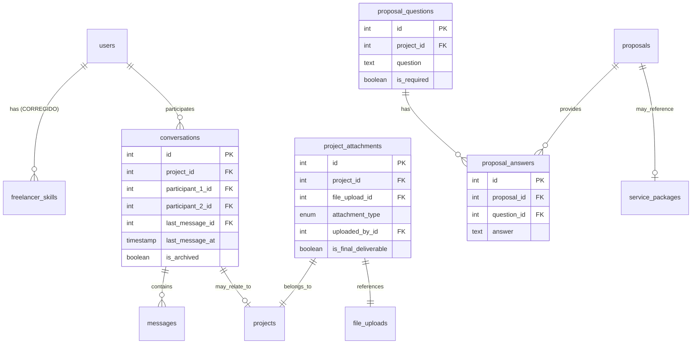

# 🔧 LaburAR - Correcciones al Diagrama ER

## ❌ Problemas Identificados en el Diagrama

### 1. **Relaciones Incorrectas**

```sql
-- PROBLEMA: freelancer_skills referencia mal
-- ACTUAL (Incorrecto):
FOREIGN KEY (freelancer_id) REFERENCES freelancer_profiles(id)

-- DEBERÍA SER:
FOREIGN KEY (freelancer_id) REFERENCES users(id)

-- RAZÓN: Los skills pertenecen al usuario, no al perfil
```

### 2. **Tabla Conversations Faltante**

```sql
-- AGREGAR: Tabla de conversaciones
CREATE TABLE conversations (
    id INT PRIMARY KEY AUTO_INCREMENT,
    project_id INT NULL, -- Puede no estar asociada a proyecto
    participant_1_id INT NOT NULL,
    participant_2_id INT NOT NULL,
    last_message_id INT NULL,
    last_message_at TIMESTAMP NULL,
    is_archived BOOLEAN DEFAULT FALSE,
    created_at TIMESTAMP DEFAULT CURRENT_TIMESTAMP,
    FOREIGN KEY (project_id) REFERENCES projects(id),
    FOREIGN KEY (participant_1_id) REFERENCES users(id),
    FOREIGN KEY (participant_2_id) REFERENCES users(id),
    FOREIGN KEY (last_message_id) REFERENCES messages(id),
    UNIQUE KEY unique_conversation (participant_1_id, participant_2_id, project_id)
);

-- ACTUALIZAR: messages debe referenciar conversations
ALTER TABLE messages 
ADD COLUMN conversation_id INT NOT NULL,
ADD FOREIGN KEY (conversation_id) REFERENCES conversations(id);
```

### 3. **Redundancia en Ratings**

```sql
-- PROBLEMA: Ratings duplicados en múltiples tablas
-- services.rating_average
-- freelancer_profiles.rating_average
-- user_reputation.overall_rating

-- SOLUCIÓN: Centralizar en user_reputation y usar vistas
CREATE VIEW freelancer_ratings AS
SELECT 
    u.id as user_id,
    ur.overall_rating,
    ur.total_reviews,
    ur.completed_projects
FROM users u
JOIN user_reputation ur ON u.id = ur.user_id
WHERE u.user_type = 'freelancer';

-- Eliminar campos redundantes:
-- ALTER TABLE freelancer_profiles DROP COLUMN rating_average;
-- ALTER TABLE services DROP COLUMN rating_average;
```

### 4. **Validación de Categories Self-Reference**

```sql
-- AGREGAR: Trigger para prevenir loops infinitos
DELIMITER //
CREATE TRIGGER prevent_category_loop 
BEFORE INSERT ON categories
FOR EACH ROW
BEGIN
    DECLARE loop_count INT DEFAULT 0;
    DECLARE current_parent INT DEFAULT NEW.parent_id;
    
    WHILE current_parent IS NOT NULL AND loop_count < 10 DO
        IF current_parent = NEW.id THEN
            SIGNAL SQLSTATE '45000' 
            SET MESSAGE_TEXT = 'Category loop detected';
        END IF;
        
        SELECT parent_id INTO current_parent 
        FROM categories 
        WHERE id = current_parent;
        
        SET loop_count = loop_count + 1;
    END WHILE;
END//
DELIMITER ;
```

## ✅ Mejoras Estructurales

### 1. **Mejorar file_uploads**

```sql
-- ACTUAL: Muy genérica
CREATE TABLE file_uploads (
    id INT PRIMARY KEY AUTO_INCREMENT,
    user_id INT NOT NULL,
    entity_type VARCHAR(50),
    entity_id INT,
    file_name VARCHAR(255) NOT NULL,
    -- ...
);

-- MEJORADA: Más específica
CREATE TABLE file_uploads (
    id INT PRIMARY KEY AUTO_INCREMENT,
    user_id INT NOT NULL,
    entity_type ENUM('profile', 'project', 'message', 'portfolio', 'service', 'proposal', 'dispute') NOT NULL,
    entity_id INT NOT NULL,
    file_name VARCHAR(255) NOT NULL,
    original_name VARCHAR(255) NOT NULL,
    file_size INT NOT NULL,
    mime_type VARCHAR(100) NOT NULL,
    storage_provider ENUM('local', 's3', 'cloudinary') DEFAULT 'local',
    storage_path VARCHAR(500) NOT NULL,
    cdn_url VARCHAR(500) NULL,
    is_public BOOLEAN DEFAULT FALSE,
    download_count INT DEFAULT 0,
    virus_scan_status ENUM('pending', 'clean', 'infected', 'error') DEFAULT 'pending',
    created_at TIMESTAMP DEFAULT CURRENT_TIMESTAMP,
    FOREIGN KEY (user_id) REFERENCES users(id),
    INDEX idx_entity (entity_type, entity_id),
    INDEX idx_user_files (user_id, created_at)
);
```

### 2. **Agregar project_attachments específica**

```sql
CREATE TABLE project_attachments (
    id INT PRIMARY KEY AUTO_INCREMENT,
    project_id INT NOT NULL,
    file_upload_id INT NOT NULL,
    attachment_type ENUM('requirement', 'deliverable', 'reference', 'feedback') NOT NULL,
    uploaded_by_id INT NOT NULL,
    description TEXT,
    is_final_deliverable BOOLEAN DEFAULT FALSE,
    created_at TIMESTAMP DEFAULT CURRENT_TIMESTAMP,
    FOREIGN KEY (project_id) REFERENCES projects(id),
    FOREIGN KEY (file_upload_id) REFERENCES file_uploads(id),
    FOREIGN KEY (uploaded_by_id) REFERENCES users(id)
);
```

### 3. **Mejorar proposals**

```sql
-- AGREGAR: Relación con service_packages
ALTER TABLE proposals 
ADD COLUMN service_package_id INT NULL,
ADD FOREIGN KEY (service_package_id) REFERENCES service_packages(id);

-- AGREGAR: Tabla para preguntas del cliente
CREATE TABLE proposal_questions (
    id INT PRIMARY KEY AUTO_INCREMENT,
    project_id INT NOT NULL,
    question TEXT NOT NULL,
    is_required BOOLEAN DEFAULT FALSE,
    created_at TIMESTAMP DEFAULT CURRENT_TIMESTAMP,
    FOREIGN KEY (project_id) REFERENCES projects(id)
);

-- AGREGAR: Respuestas en proposals
CREATE TABLE proposal_answers (
    id INT PRIMARY KEY AUTO_INCREMENT,
    proposal_id INT NOT NULL,
    question_id INT NOT NULL,
    answer TEXT NOT NULL,
    created_at TIMESTAMP DEFAULT CURRENT_TIMESTAMP,
    FOREIGN KEY (proposal_id) REFERENCES proposals(id),
    FOREIGN KEY (question_id) REFERENCES proposal_questions(id),
    UNIQUE KEY unique_proposal_answer (proposal_id, question_id)
);
```

## 🔄 Diagrama ER Corregido (Cambios Principales)



## 📋 Checklist de Implementación

### Fase 1: Correcciones Críticas
- [ ] Crear tabla `conversations`
- [ ] Actualizar FK en `freelancer_skills`
- [ ] Agregar `conversation_id` a `messages`
- [ ] Implementar trigger para categories

### Fase 2: Mejoras Estructurales  
- [ ] Mejorar `file_uploads` con más campos
- [ ] Crear `project_attachments`
- [ ] Agregar `proposal_questions` y `proposal_answers`
- [ ] Eliminar campos redundantes de rating

### Fase 3: Optimizaciones
- [ ] Crear vistas para ratings centralizados
- [ ] Agregar índices de performance
- [ ] Implementar stored procedures para cálculos
- [ ] Configurar triggers de auditoría

## 🎯 Impacto de las Correcciones

### Beneficios:
1. **Integridad referencial** mejorada
2. **Performance** optimizada con índices correctos
3. **Escalabilidad** con estructura más limpia
4. **Mantenimiento** más fácil con menos redundancia

### Riesgos:
1. **Migración de datos** existentes
2. **Actualización de código** que usa las tablas antiguas
3. **Testing** exhaustivo de nuevas relaciones

## 🚀 Recomendación Final

Implementar las correcciones en **3 fases**:
1. **Críticas** (1 semana)
2. **Mejoras** (2 semanas) 
3. **Optimizaciones** (1 semana)

Total: **4 semanas** para tener el modelo perfecto.