# 🗂️ LaburAR - Diagrama Entidad-Relación

## 📊 Diagrama Completo de Base de Datos

```mermaid
erDiagram
    %% ====================================
    %% USUARIOS Y AUTENTICACIÓN
    %% ====================================
    
    users {
        int id PK
        varchar email UK
        varchar password_hash
        enum user_type "client, freelancer, admin"
        varchar first_name
        varchar last_name
        varchar phone
        varchar country
        varchar city
        text profile_image
        enum status "active, inactive, suspended"
        timestamp email_verified_at
        timestamp last_active
        decimal wallet_balance
        timestamp created_at
        timestamp updated_at
    }
    
    user_sessions {
        int id PK
        int user_id FK
        varchar session_token UK
        varchar ip_address
        text user_agent
        timestamp expires_at
        timestamp created_at
    }
    
    password_resets {
        int id PK
        varchar email
        varchar token
        timestamp expires_at
        timestamp created_at
    }
    
    refresh_tokens {
        int id PK
        int user_id FK
        varchar token_hash UK
        timestamp expires_at
        varchar ip_address
        timestamp created_at
    }
    
    freelancer_profiles {
        int id PK
        int user_id FK
        text bio
        varchar title
        decimal hourly_rate
        varchar availability
        text skills
        text portfolio_url
        decimal rating_average
        int total_projects
        int total_reviews
        decimal total_earned
        timestamp created_at
        timestamp updated_at
    }
    
    %% ====================================
    %% HABILIDADES Y PORTFOLIO
    %% ====================================
    
    skills {
        int id PK
        varchar name UK
        varchar slug UK
        varchar category
        boolean is_trending
        int usage_count
        timestamp created_at
    }
    
    freelancer_skills {
        int id PK
        int freelancer_id FK
        int skill_id FK
        enum proficiency_level "beginner, intermediate, advanced, expert"
        int years_experience
        int endorsed_count
        timestamp created_at
    }
    
    portfolio_items {
        int id PK
        int freelancer_id FK
        varchar title
        text description
        int category_id FK
        varchar project_url
        json media_files
        json technologies_used
        date completion_date
        varchar client_name
        boolean is_featured
        int view_count
        timestamp created_at
    }
    
    %% ====================================
    %% SERVICIOS Y CATEGORÍAS
    %% ====================================
    
    categories {
        int id PK
        varchar name
        varchar slug UK
        text description
        varchar icon
        int parent_id FK
        int sort_order
        boolean is_active
        timestamp created_at
    }
    
    services {
        int id PK
        int freelancer_id FK
        int category_id FK
        varchar title
        text description
        decimal base_price
        int delivery_time
        text requirements
        json gallery_images
        json extras
        decimal rating_average
        int total_orders
        int total_reviews
        boolean is_active
        timestamp created_at
        timestamp updated_at
    }
    
    service_packages {
        int id PK
        int service_id FK
        enum package_type "basic, standard, premium"
        varchar name
        text description
        decimal price
        int delivery_time
        json features
        int max_revisions
        timestamp created_at
    }
    
    %% ====================================
    %% PROYECTOS Y PROPUESTAS
    %% ====================================
    
    projects {
        int id PK
        int client_id FK
        int freelancer_id FK
        int category_id FK
        varchar title
        text description
        decimal budget_min
        decimal budget_max
        enum budget_type "fixed, hourly"
        date deadline
        enum status "draft, published, in_progress, completed, cancelled, disputed"
        json required_skills
        enum experience_level "entry, intermediate, expert"
        int proposal_count
        timestamp created_at
        timestamp updated_at
    }
    
    proposals {
        int id PK
        int project_id FK
        int freelancer_id FK
        text cover_letter
        decimal proposed_amount
        int proposed_timeline
        json attachments
        enum status "pending, shortlisted, accepted, rejected, withdrawn"
        timestamp client_viewed_at
        timestamp created_at
        timestamp updated_at
    }
    
    project_milestones {
        int id PK
        int project_id FK
        varchar title
        text description
        decimal amount
        date due_date
        enum status "pending, in_progress, completed, approved, disputed"
        timestamp created_at
        timestamp updated_at
    }
    
    %% ====================================
    %% SISTEMA DE PAGOS
    %% ====================================
    
    wallets {
        int id PK
        int user_id FK
        decimal balance
        decimal pending_balance
        decimal lifetime_earnings
        varchar currency
        timestamp last_transaction_at
        timestamp created_at
        timestamp updated_at
    }
    
    payment_methods {
        int id PK
        int user_id FK
        enum type "credit_card, debit_card, bank_account, mercadopago, paypal"
        varchar provider
        varchar last_four
        varchar brand
        boolean is_default
        json metadata
        timestamp created_at
    }
    
    transactions {
        int id PK
        int from_user_id FK
        int to_user_id FK
        int project_id FK
        varchar transaction_id UK
        enum type "payment, refund, withdrawal, fee, bonus"
        decimal amount
        varchar currency
        enum status "pending, processing, completed, failed, cancelled"
        varchar payment_method
        varchar gateway_response
        json metadata
        timestamp processed_at
        timestamp created_at
    }
    
    escrow_accounts {
        int id PK
        int project_id FK
        int client_id FK
        int freelancer_id FK
        decimal amount
        enum status "created, funded, released, refunded, disputed"
        timestamp funded_at
        timestamp released_at
        timestamp created_at
    }
    
    withdrawal_requests {
        int id PK
        int user_id FK
        decimal amount
        varchar payment_method
        json payment_details
        enum status "pending, processing, completed, rejected"
        text admin_notes
        timestamp processed_at
        timestamp created_at
    }
    
    %% ====================================
    %% COMUNICACIÓN
    %% ====================================
    
    conversations {
        int id PK
        int project_id FK
        json participants
        varchar last_message
        timestamp last_message_at
        int unread_count_client
        int unread_count_freelancer
        timestamp created_at
    }
    
    messages {
        int id PK
        int conversation_id FK
        int sender_id FK
        int receiver_id FK
        text message_content
        enum message_type "text, file, image, system"
        json attachments
        boolean is_read
        timestamp read_at
        timestamp created_at
    }
    
    video_calls {
        int id PK
        int conversation_id FK
        int initiator_id FK
        varchar room_id
        int duration_minutes
        enum status "scheduled, ongoing, completed, cancelled"
        timestamp started_at
        timestamp ended_at
        timestamp created_at
    }
    
    %% ====================================
    %% REVIEWS Y REPUTACIÓN
    %% ====================================
    
    reviews {
        int id PK
        int project_id FK
        int reviewer_id FK
        int reviewee_id FK
        enum reviewer_type "client, freelancer"
        int rating
        text comment
        json criteria_ratings
        boolean is_public
        timestamp created_at
        timestamp updated_at
    }
    
    review_responses {
        int id PK
        int review_id FK
        int user_id FK
        text response
        timestamp created_at
    }
    
    user_reputation {
        int user_id PK
        decimal overall_rating
        int total_reviews
        int completed_projects
        decimal success_rate
        int response_time_avg
        decimal client_satisfaction
        timestamp last_calculated
        timestamp updated_at
    }
    
    %% ====================================
    %% GAMIFICACIÓN Y BADGES
    %% ====================================
    
    badge_categories {
        int id PK
        varchar name
        varchar description
        varchar icon
        int sort_order
        timestamp created_at
    }
    
    badges {
        int id PK
        int category_id FK
        varchar name
        text description
        varchar icon
        enum rarity "comun, raro, epico, legendario, exclusivo"
        json requirements
        boolean is_active
        int earned_count
        timestamp created_at
    }
    
    user_badges {
        int id PK
        int user_id FK
        int badge_id FK
        timestamp earned_at
        json progress_data
        boolean is_featured
    }
    
    badge_milestones {
        int id PK
        int badge_id FK
        varchar milestone_name
        json requirements
        int sort_order
        timestamp created_at
    }
    
    %% ====================================
    %% GESTIÓN DE ARCHIVOS
    %% ====================================
    
    file_uploads {
        int id PK
        int user_id FK
        varchar entity_type
        int entity_id
        varchar file_name
        int file_size
        varchar file_type
        varchar storage_path
        varchar cdn_url
        boolean is_public
        int download_count
        timestamp created_at
    }
    
    %% ====================================
    %% NOTIFICACIONES Y PREFERENCIAS
    %% ====================================
    
    notifications {
        int id PK
        int user_id FK
        varchar title
        text message
        enum type "system, project, payment, message, review, badge"
        json data
        boolean is_read
        timestamp read_at
        timestamp created_at
    }
    
    notification_preferences {
        int user_id PK
        json email_notifications
        json push_notifications
        json sms_notifications
        enum notification_frequency "instant, hourly, daily, weekly"
        time quiet_hours_start
        time quiet_hours_end
        timestamp updated_at
    }
    
    %% ====================================
    %% FUNCIONALIDADES ADICIONALES
    %% ====================================
    
    favorites {
        int id PK
        int user_id FK
        enum entity_type "freelancer, service, project"
        int entity_id
        text notes
        timestamp created_at
    }
    
    saved_searches {
        int id PK
        int user_id FK
        varchar search_name
        json search_criteria
        enum alert_frequency "never, daily, weekly, instant"
        timestamp last_alert_sent
        timestamp created_at
    }
    
    disputes {
        int id PK
        int project_id FK
        int initiator_id FK
        int respondent_id FK
        enum reason "payment, quality, communication, scope, deadline"
        text description
        enum status "open, investigating, mediation, resolved, closed"
        json evidence
        text resolution
        int admin_id FK
        timestamp resolved_at
        timestamp created_at
    }
    
    support_tickets {
        int id PK
        int user_id FK
        varchar subject
        text description
        enum category "technical, payment, account, dispute, general"
        enum priority "low, medium, high, urgent"
        enum status "open, pending, resolved, closed"
        int assigned_admin_id FK
        timestamp first_response_at
        timestamp resolved_at
        timestamp created_at
    }
    
    %% ====================================
    %% SISTEMA DE EQUIPOS
    %% ====================================
    
    teams {
        int id PK
        int owner_id FK
        varchar name
        text description
        varchar logo_url
        boolean is_active
        timestamp created_at
    }
    
    team_members {
        int id PK
        int team_id FK
        int user_id FK
        enum role "owner, admin, member"
        json permissions
        timestamp joined_at
    }
    
    %% ====================================
    %% ANALYTICS Y LOGS
    %% ====================================
    
    activity_logs {
        int id PK
        int user_id FK
        varchar action
        varchar entity_type
        int entity_id
        json data
        varchar ip_address
        text user_agent
        timestamp created_at
    }
    
    conversion_tracking {
        int id PK
        int user_id FK
        varchar event_type
        varchar source
        json metadata
        decimal value
        timestamp created_at
    }
    
    daily_metrics {
        date date PK
        int new_users
        int active_users
        int projects_created
        int projects_completed
        decimal total_revenue
        decimal avg_project_value
        timestamp created_at
    }
    
    %% ====================================
    %% RELACIONES
    %% ====================================
    
    %% Users relationships
    users ||--o{ user_sessions : "has"
    users ||--o{ refresh_tokens : "has"
    users ||--o| freelancer_profiles : "has"
    users ||--o{ freelancer_skills : "has"
    users ||--o{ portfolio_items : "creates"
    users ||--o{ services : "offers"
    users ||--o{ projects : "creates_as_client"
    users ||--o{ projects : "works_as_freelancer"
    users ||--o{ proposals : "submits"
    users ||--o| wallets : "owns"
    users ||--o{ payment_methods : "has"
    users ||--o{ transactions : "sends"
    users ||--o{ transactions : "receives"
    users ||--o{ messages : "sends"
    users ||--o{ messages : "receives"
    users ||--o{ reviews : "writes"
    users ||--o{ reviews : "receives"
    users ||--o| user_reputation : "has"
    users ||--o{ user_badges : "earns"
    users ||--o{ file_uploads : "uploads"
    users ||--o{ notifications : "receives"
    users ||--o| notification_preferences : "has"
    users ||--o{ favorites : "saves"
    users ||--o{ saved_searches : "creates"
    users ||--o{ disputes : "initiates"
    users ||--o{ support_tickets : "creates"
    users ||--o{ teams : "owns"
    users ||--o{ team_members : "joins"
    users ||--o{ activity_logs : "generates"
    
    %% Skills relationships
    skills ||--o{ freelancer_skills : "defines"
    
    %% Categories relationships
    categories ||--o{ categories : "parent_of"
    categories ||--o{ services : "categorizes"
    categories ||--o{ projects : "categorizes"
    categories ||--o{ portfolio_items : "categorizes"
    
    %% Services relationships
    services ||--o{ service_packages : "has"
    
    %% Projects relationships
    projects ||--o{ proposals : "receives"
    projects ||--o{ project_milestones : "has"
    projects ||--o{ conversations : "generates"
    projects ||--o{ escrow_accounts : "uses"
    projects ||--o{ reviews : "generates"
    projects ||--o{ disputes : "may_have"
    
    %% Communication relationships
    conversations ||--o{ messages : "contains"
    conversations ||--o{ video_calls : "may_have"
    
    %% Reviews relationships
    reviews ||--o{ review_responses : "may_have"
    
    %% Badges relationships
    badge_categories ||--o{ badges : "contains"
    badges ||--o{ user_badges : "awarded_as"
    badges ||--o{ badge_milestones : "has"
    
    %% Teams relationships
    teams ||--o{ team_members : "has"
```

## 📊 Estadísticas del Diagrama

- **Total de tablas**: 45 tablas
- **Tablas existentes**: 20 tablas ✅
- **Tablas faltantes**: 25 tablas ❌
- **Relaciones principales**: 60+ relaciones FK

## 🎯 Leyenda de Colores y Símbolos

### Tipos de Relación
- `||--o{` : Uno a muchos (1:N)
- `||--o|` : Uno a uno (1:1)
- `}o--o{` : Muchos a muchos (N:M)

### Estado de Implementación
- ✅ **Implementado**: Tabla existe en la BD
- ❌ **Faltante**: Tabla necesaria pero no existe
- ⚠️ **Parcial**: Tabla existe pero le faltan campos

## 🏗️ Módulos Principales

### 1. 👤 **Gestión de Usuarios** (5 tablas)
- Autenticación, perfiles, sesiones

### 2. 🎯 **Skills & Portfolio** (3 tablas)
- Habilidades y trabajos previos

### 3. 💼 **Servicios** (3 tablas)
- Catálogo de servicios y paquetes

### 4. 📋 **Proyectos** (4 tablas)
- Gestión completa de proyectos

### 5. 💰 **Pagos** (6 tablas)
- Sistema financiero completo

### 6. 💬 **Comunicación** (4 tablas)
- Chat y videollamadas

### 7. ⭐ **Reviews** (3 tablas)
- Sistema de calificaciones

### 8. 🏆 **Gamificación** (4 tablas)
- Badges y logros

### 9. 📁 **Archivos** (1 tabla)
- Gestión de uploads

### 10. 🔔 **Notificaciones** (2 tablas)
- Sistema de alertas

### 11. ❤️ **Favoritos** (2 tablas)
- Guardados y búsquedas

### 12. ⚖️ **Disputas** (2 tablas)
- Resolución de conflictos

### 13. 👥 **Equipos** (2 tablas)
- Trabajo colaborativo

### 14. 📊 **Analytics** (3 tablas)
- Métricas y seguimiento

## 🚀 Próximos Pasos

1. **Revisar el diagrama** completo
2. **Priorizar las tablas** faltantes críticas
3. **Crear scripts SQL** para implementación
4. **Migrar datos** existentes si es necesario
5. **Actualizar modelos** en el código

¿Quieres que proceda a crear las tablas faltantes más críticas?