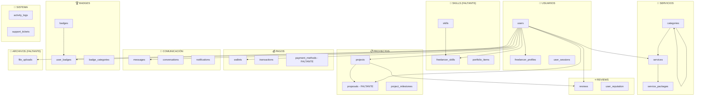
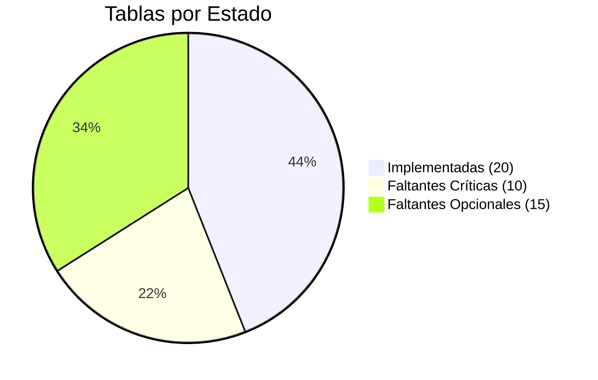
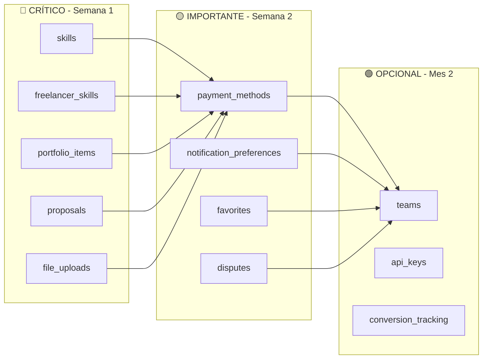

# 🗂️ LaburAR - Diagrama ER Simplificado (Para Visualización)

## 📊 Diagrama Principal - Core Tables

```mermaid
erDiagram
    %% USUARIOS CORE
    users {
        int id PK
        varchar email UK
        varchar password_hash
        enum user_type
        varchar first_name
        varchar last_name
        decimal wallet_balance
        timestamp created_at
    }
    
    freelancer_profiles {
        int id PK
        int user_id FK
        text bio
        varchar title
        decimal hourly_rate
        decimal rating_average
        int total_projects
    }
    
    %% HABILIDADES (FALTANTE)
    skills {
        int id PK
        varchar name UK
        varchar category
        boolean is_trending
    }
    
    freelancer_skills {
        int id PK
        int freelancer_id FK
        int skill_id FK
        enum proficiency_level
        int years_experience
    }
    
    %% SERVICIOS
    categories {
        int id PK
        varchar name
        varchar slug UK
        int parent_id FK
    }
    
    services {
        int id PK
        int freelancer_id FK
        int category_id FK
        varchar title
        decimal base_price
        boolean is_active
    }
    
    service_packages {
        int id PK
        int service_id FK
        enum package_type
        decimal price
        int delivery_time
    }
    
    %% PROYECTOS
    projects {
        int id PK
        int client_id FK
        int freelancer_id FK
        varchar title
        decimal budget_min
        decimal budget_max
        enum status
    }
    
    proposals {
        int id PK
        int project_id FK
        int freelancer_id FK
        decimal proposed_amount
        enum status
    }
    
    %% PAGOS
    wallets {
        int id PK
        int user_id FK
        decimal balance
        decimal pending_balance
    }
    
    transactions {
        int id PK
        int from_user_id FK
        int to_user_id FK
        decimal amount
        enum status
    }
    
    %% COMUNICACIÓN
    messages {
        int id PK
        int sender_id FK
        int receiver_id FK
        text message_content
        boolean is_read
    }
    
    %% REVIEWS
    reviews {
        int id PK
        int project_id FK
        int reviewer_id FK
        int reviewee_id FK
        int rating
        text comment
    }
    
    %% BADGES
    badges {
        int id PK
        varchar name
        enum rarity
        boolean is_active
    }
    
    user_badges {
        int id PK
        int user_id FK
        int badge_id FK
        timestamp earned_at
    }
    
    %% ARCHIVOS (FALTANTE)
    file_uploads {
        int id PK
        int user_id FK
        varchar entity_type
        int entity_id
        varchar file_name
        varchar storage_path
    }
    
    %% RELACIONES PRINCIPALES
    users ||--o| freelancer_profiles : has
    users ||--o{ freelancer_skills : has
    users ||--o{ services : offers
    users ||--o{ projects : creates
    users ||--o{ proposals : submits
    users ||--o| wallets : owns
    users ||--o{ transactions : participates
    users ||--o{ messages : sends
    users ||--o{ reviews : writes
    users ||--o{ user_badges : earns
    users ||--o{ file_uploads : uploads
    
    skills ||--o{ freelancer_skills : defines
    categories ||--o{ services : categorizes
    categories ||--o{ categories : parent_of
    services ||--o{ service_packages : has
    projects ||--o{ proposals : receives
    projects ||--o{ reviews : generates
    badges ||--o{ user_badges : awarded_as
```

## 📋 Tablas por Módulo (Vista Organizacional)

## 📊 Estado de Implementación

## 🚨 Prioridades de Implementación

