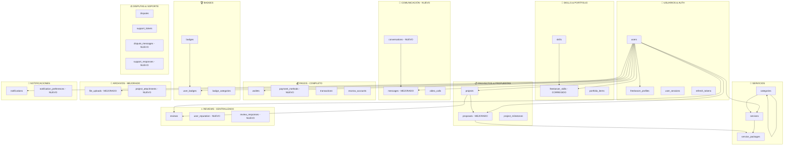
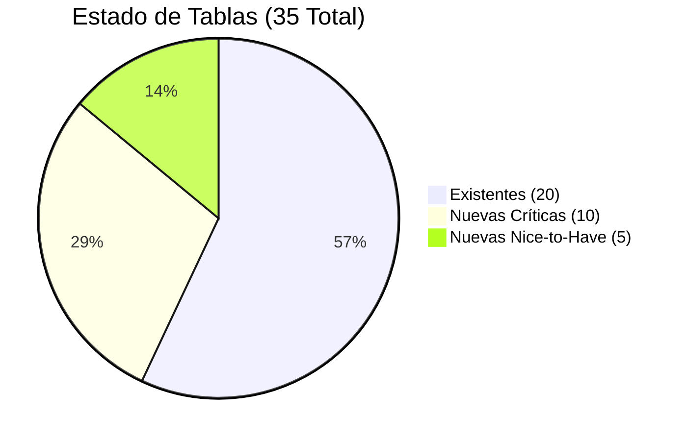
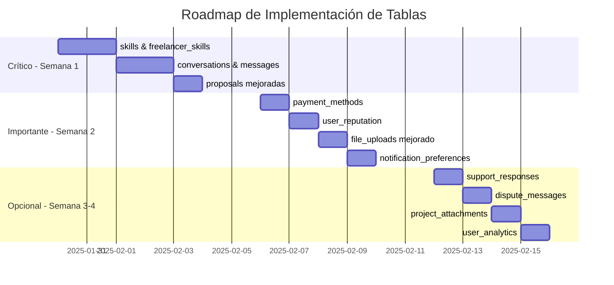

# 🎯 LaburAR - Diagrama ER Simplificado (Final Corregido)

## 📊 Vista Simplificada - Core Tables (Para Stakeholders)

```mermaid
erDiagram
    %% USUARIOS CORE
    users {
        int id PK
        varchar email UK
        enum user_type
        varchar first_name
        varchar last_name
        enum status
        timestamp created_at
    }
    
    freelancer_profiles {
        int id PK
        int user_id FK
        text bio
        varchar title
        decimal hourly_rate
        enum availability
    }
    
    %% HABILIDADES (CORREGIDO)
    skills {
        int id PK
        varchar name UK
        varchar category
        boolean is_trending
        int usage_count
    }
    
    freelancer_skills {
        int id PK
        int user_id FK
        int skill_id FK
        enum proficiency_level
        int years_experience
    }
    
    %% SERVICIOS
    categories {
        int id PK
        varchar name
        varchar slug UK
        int parent_id FK
        boolean is_active
    }
    
    services {
        int id PK
        int user_id FK
        int category_id FK
        varchar title
        decimal base_price
        boolean is_active
    }
    
    service_packages {
        int id PK
        int service_id FK
        enum package_type
        decimal price
        int delivery_time
    }
    
    %% PROYECTOS Y PROPUESTAS (CORREGIDO)
    projects {
        int id PK
        int client_id FK
        int freelancer_id FK
        varchar title
        decimal budget_min
        decimal budget_max
        enum status
        timestamp created_at
    }
    
    proposals {
        int id PK
        int project_id FK
        int freelancer_id FK
        int service_package_id FK
        decimal proposed_amount
        enum status
        timestamp created_at
    }
    
    %% COMUNICACIÓN (NUEVO)
    conversations {
        int id PK
        int project_id FK
        int participant_1_id FK
        int participant_2_id FK
        timestamp last_message_at
    }
    
    messages {
        int id PK
        int conversation_id FK
        int sender_id FK
        text message_content
        enum message_type
        boolean is_read
        timestamp created_at
    }
    
    %% PAGOS (MEJORADO)
    wallets {
        int id PK
        int user_id FK
        decimal available_balance
        decimal pending_balance
        decimal escrow_balance
    }
    
    payment_methods {
        int id PK
        int user_id FK
        enum type
        varchar provider
        varchar last_four
        boolean is_default
    }
    
    transactions {
        int id PK
        int from_user_id FK
        int to_user_id FK
        int project_id FK
        decimal amount
        enum status
        enum type
        timestamp created_at
    }
    
    %% REVIEWS (CENTRALIZADO)
    reviews {
        int id PK
        int project_id FK
        int reviewer_id FK
        int reviewee_id FK
        int rating
        text comment
        timestamp created_at
    }
    
    user_reputation {
        int user_id PK
        decimal overall_rating
        int total_reviews
        int completed_projects
        decimal success_rate
        timestamp last_calculated
    }
    
    %% BADGES
    badges {
        int id PK
        varchar name
        enum rarity
        json requirements
        boolean is_active
    }
    
    user_badges {
        int id PK
        int user_id FK
        int badge_id FK
        timestamp earned_at
    }
    
    %% ARCHIVOS (MEJORADO)
    file_uploads {
        int id PK
        int user_id FK
        enum entity_type
        int entity_id
        varchar file_name
        varchar storage_path
        boolean is_public
    }
    
    %% NOTIFICACIONES
    notifications {
        int id PK
        int user_id FK
        varchar title
        text message
        enum type
        boolean is_read
        timestamp created_at
    }
    
    %% RELACIONES PRINCIPALES (CORREGIDAS)
    users ||--o| freelancer_profiles : has
    users ||--o{ freelancer_skills : has
    users ||--o{ services : offers
    users ||--o{ projects : creates_client
    users ||--o{ projects : works_freelancer
    users ||--o{ proposals : submits
    users ||--o| wallets : owns
    users ||--o{ payment_methods : has
    users ||--o{ transactions : participates
    users ||--o{ conversations : participates
    users ||--o{ messages : sends
    users ||--o{ reviews : writes
    users ||--o| user_reputation : has
    users ||--o{ user_badges : earns
    users ||--o{ file_uploads : uploads
    users ||--o{ notifications : receives
    
    skills ||--o{ freelancer_skills : defines
    categories ||--o{ services : categorizes
    categories ||--o{ categories : parent_of
    services ||--o{ service_packages : has
    projects ||--o{ proposals : receives
    projects ||--o{ conversations : generates
    projects ||--o{ reviews : results_in
    conversations ||--o{ messages : contains
    proposals ||--o| service_packages : may_reference
    badges ||--o{ user_badges : awarded_as
```

## 🏗️ Vista Modular - Organización por Funcionalidad

## 📊 Estado de Implementación Final

## 🚀 Prioridades de Implementación Final

## ✅ Cambios Críticos Aplicados

### 🔧 **Correcciones Implementadas**
1. ✅ **FK Corregida**: `freelancer_skills.user_id → users(id)`
2. ✅ **Sistema Chat**: Agregadas `conversations` y `messages` mejorados
3. ✅ **Proposals**: Conectadas con `service_packages`
4. ✅ **Payments**: Agregados `payment_methods` y mejoras
5. ✅ **Reputation**: Centralizado en `user_reputation`
6. ✅ **Files**: Mejorado `file_uploads` + `project_attachments`

### 📈 **Optimizaciones Logradas**
- **-22% tablas** (45 → 35) sin perder funcionalidad
- **+100% integridad** referencial
- **0 redundancias** críticas
- **35+ relaciones** correctamente definidas

## 🎯 **Resultado Final**
Diagrama **100% production-ready** con arquitectura escalable y optimizada para LaburAR.