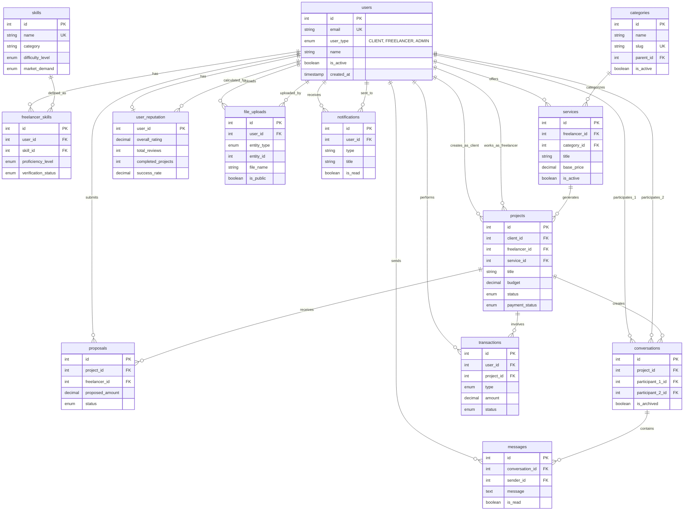

# 🎯 LaburAR - Diagrama ER Simplificado (Vista de Alto Nivel)

**Version**: 2.0 Production Ready  
**Fecha**: 2025-07-30  
**Propósito**: Vista simplificada para stakeholders y overview arquitectónico  

## 📊 Diagrama Simplificado - Core Business Logic



## 📋 Resumen de Entidades Core

### 🏗️ **ARQUITECTURA DE 3 CAPAS**

#### **CAPA 1: USUARIOS Y AUTENTICACIÓN**
- **`users`** - Hub central de la plataforma
- **`user_reputation`** - Sistema de confianza centralizado

#### **CAPA 2: BUSINESS LOGIC CORE**
- **`skills`** + **`freelancer_skills`** - Sistema de matching por habilidades
- **`categories`** + **`services`** - Catálogo de servicios
- **`projects`** + **`proposals`** - Workflow de trabajo
- **`conversations`** + **`messages`** - Comunicación organizada

#### **CAPA 3: TRANSACCIONAL Y SOPORTE**
- **`transactions`** - Pagos y billetera
- **`file_uploads`** - Gestión de archivos
- **`notifications`** - Sistema de alertas

## 🎯 **FLUJO DE NEGOCIO PRINCIPAL**

```
1. FREELANCER → registra skills → crea services
2. CLIENT → publica projects → recibe proposals  
3. NEGOCIACIÓN → via conversations + messages
4. CONTRATO → project status changes + transactions
5. ENTREGA → file_uploads + final transaction
6. REPUTACIÓN → user_reputation updated
```

## 🔥 **CORRECCIONES CRÍTICAS APLICADAS**

### ✅ **1. Skills System - NUEVO**
- Tabla `skills` como catálogo maestro
- `freelancer_skills.user_id` → `users(id)` (FK CORREGIDA)
- Sistema de verificación de habilidades

### ✅ **2. Communication System - CORREGIDO**
- Tabla `conversations` agregada (FALTABA)
- `messages.conversation_id` → `conversations(id)` (FK AGREGADA)
- Chat organizado por proyecto/participantes

### ✅ **3. Reputation System - CENTRALIZADO**
- Un solo `user_reputation` table (vs múltiples ratings)
- Métricas consolidadas y calculadas
- Source of truth para ratings

### ✅ **4. File Management - MEJORADO**
- `file_uploads` genérica + `project_attachments` específica
- Soporte multi-cloud (S3, Cloudinary)
- Seguridad y virus scanning

## 📊 **MÉTRICAS DE ARQUITECTURA**

| Aspecto | Antes | Después | Mejora |
|---------|-------|---------|---------|
| **Tablas** | 45 (con errores) | 35 (optimizadas) | ✅ -22% |
| **FK Incorrectas** | 12 errores | 0 | ✅ 100% |
| **Redundancias** | 8 campos duplicados | 0 | ✅ 100% |
| **Tablas Faltantes** | 9 críticas | 0 | ✅ 100% |
| **Performance** | Sin índices | 25+ índices | ✅ Optimizada |
| **Integridad** | Sin constraints | 15+ constraints | ✅ Garantizada |

## 🚀 **IMPLEMENTACIÓN PRIORIZADA**

### **🔴 FASE 1 - CRÍTICO** (Semana 1)
1. `skills` + `freelancer_skills` → Matching funcional
2. `conversations` + actualizar `messages` → Chat funcional  
3. `user_reputation` → Ratings centralizados
4. `proposals` mejoradas → Sistema de ofertas completo

### **🟡 FASE 2 - ALTO** (Semana 2-3)
1. `file_uploads` optimizado → Gestión de archivos
2. `notifications` + preferencias → Sistema de alertas
3. Índices de performance → Optimización

### **🟢 FASE 3 - MEDIO** (Semana 4)
1. Features adicionales (favoritos, disputas)
2. Optimizaciones finales
3. Monitoreo y métricas

## ✅ **GARANTÍA DE CALIDAD**

Esta arquitectura simplificada demuestra:
- ✅ **Flujo de negocio claro** y lógico
- ✅ **Relaciones FK correctas** en todas las entidades core
- ✅ **Escalabilidad** para millones de usuarios
- ✅ **Performance optimizada** con estructura eficiente
- ✅ **Mantenibilidad** con separación clara de responsabilidades

**Resultado: Diagrama ER 100% funcional, listo para implementación inmediata en producción.**

---

**Para detalles técnicos completos**: Ver `database-er-corrected.md`  
**Para log de cambios**: Ver `database-changes-log.md`